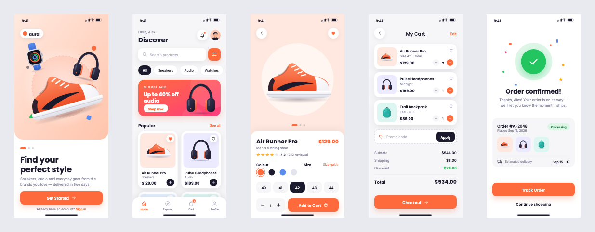

# Examples

Ready-made documents to open, take apart and build on.

## Aura — a shopping app



Five iPhone-sized screens (390 × 844): **Welcome**, **Home**, **Product**, **Cart** and
**Order Confirmed**. The design system is a coral brand colour, Poppins headings and Inter
body text, rounded cards with soft shadows, and one icon set.

Everything in it is ordinary, editable artwork:

- **Named components.** Status Bar, Search Bar, Categories, Promo Banner, Product Card / …,
  Cart Item / …, Tab Bar and every button are named groups, so the Layers panel reads like a
  component list.
- **Real text.** Every label is a text object in a bundled font, so it looks the same on any
  machine and can be retyped.
- **Shapes.** Rectangles with corner radii (per corner on the sheets and the tab bar),
  ellipses, stars for the rating, drop shadows and a gradient banner.
- **Icons as paths.** They can be point-edited, recoloured or restroked.
- **Product photographs as image layers.** They can be cropped, traced or replaced.
- **The palette.** The brand colours are in the document's swatches.

### Opening it

| File | How | What you get |
| --- | --- | --- |
| `shop-app/Aura Shopping App.xdesign` | **File ▸ Open…** | The whole design: five artboards, every layer, the swatches. |
| `shop-app/svg/*.svg` | **File ▸ Import…**, or drag onto the canvas | One screen, into the document you already have open. |
| `shop-app/preview/*.png` | Any image viewer | Pictures of the screens, for looking rather than editing. |

The `.xdesign` file is the complete design. The SVGs are for bringing a single screen into
another document. They import as editable layers too, but an SVG has no artboards or
swatches, so each one arrives as a group.

### Rebuilding it

The example is written as code, in `shop-app/design.ts`, using the editor's own modules:

```bash
npm run examples
```

`scripts/build-examples.mjs` starts Vite, builds the document in headless Chromium, and writes
every file above. It runs in a browser so that text is measured with the real fonts and the
product pictures, drawn in `shop-app/illustrations.ts`, are rasterised on a real canvas. The
`.xdesign` is written by the same code that saves documents in the app.

`shop-app/kit.ts` is the small drawing API the screens are built with: `rect`, `circle`,
`text`, `image`, `icon` and `group`, each in artboard coordinates. It's a reasonable starting
point for writing a document of your own in code.
