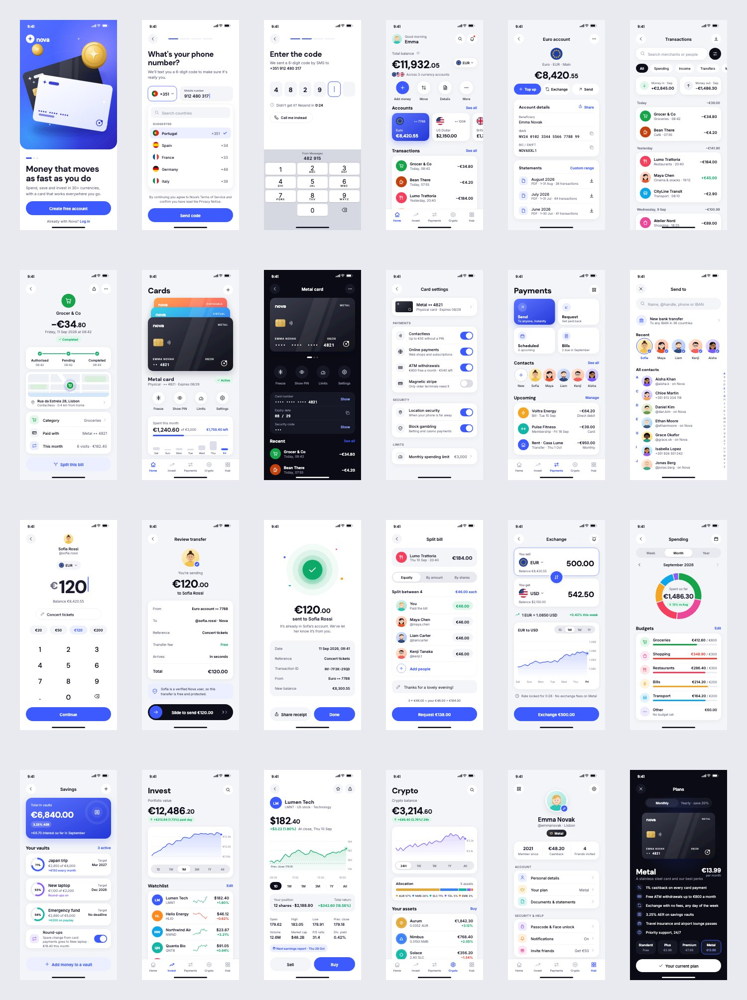
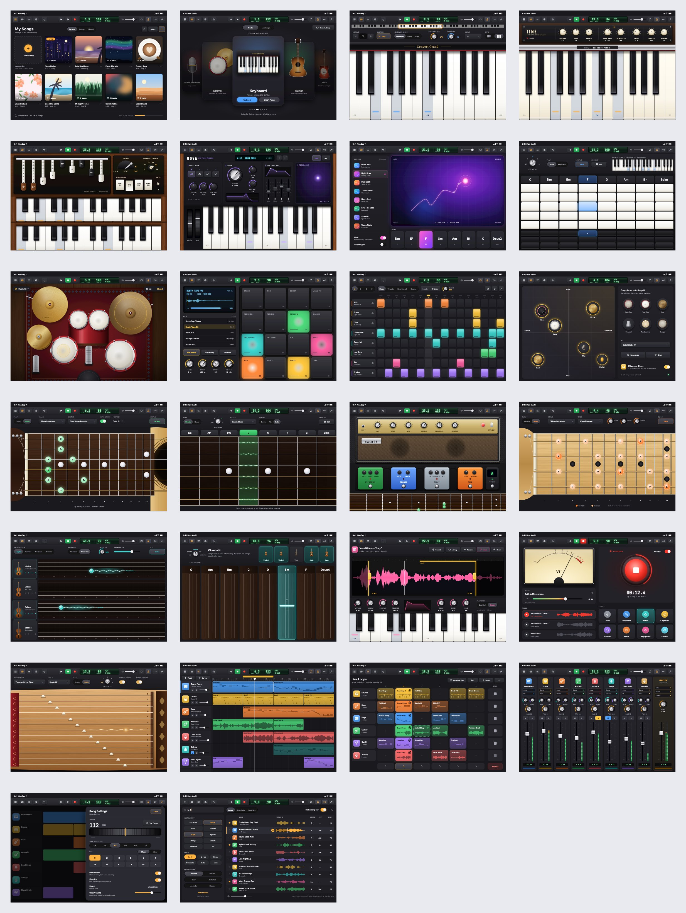
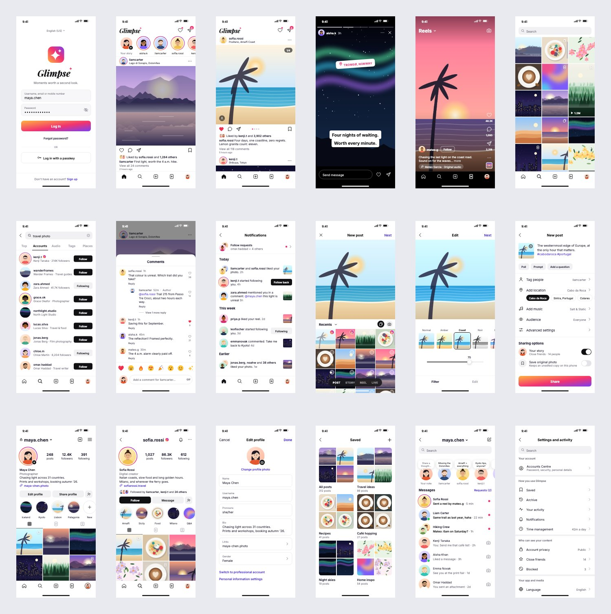
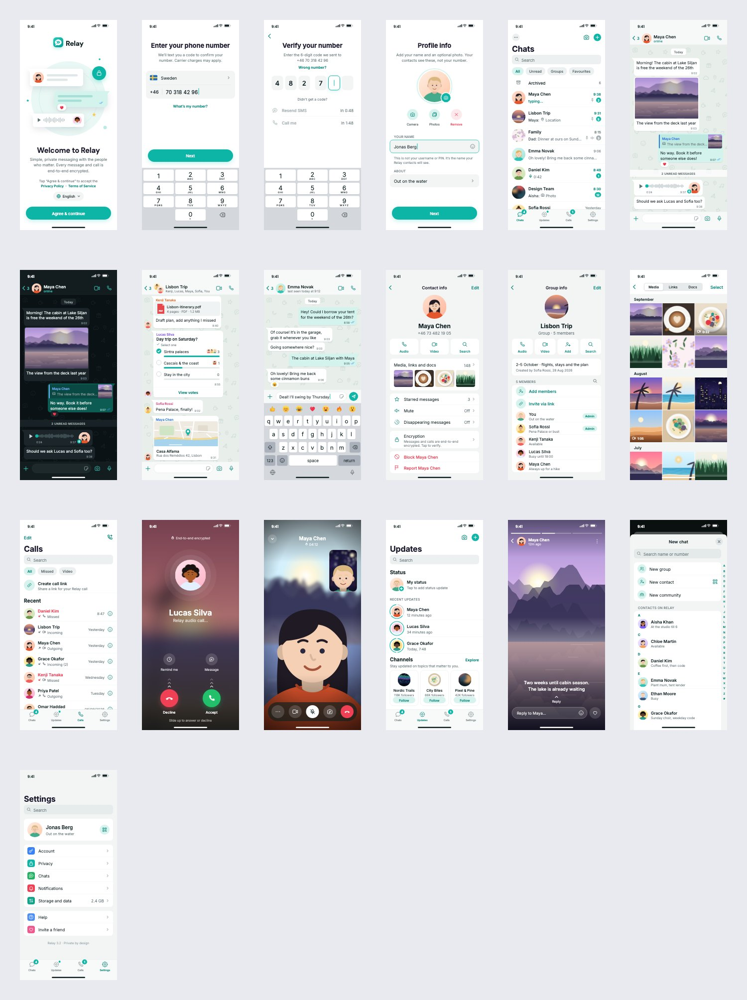
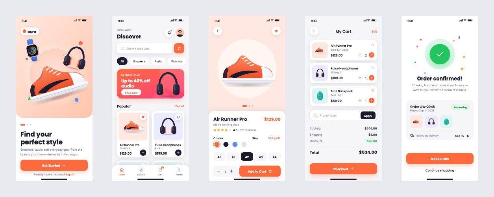

# Examples

Ready-made documents to open, take apart and build on. Every one is ordinary, editable artwork:

- **Named components.** Every component is a named group, so the Layers panel reads like a
  component library.
- **Real text.** All text is in the fonts the app bundles, so it looks the same on any machine
  and can be retyped.
- **Shapes.** Rectangles with corner radii, gradients and shadows.
- **Icons as paths.** They can be point-edited.
- **Pictures as image layers.** They can be cropped, traced or replaced.
- **The palette.** Each brand's colours are in the document's swatches.

| Example | Screens | Size |
| --- | --- | --- |
| [Nova — a banking app](#nova--a-banking-app) | 24 | iPhone, 390 × 844 |
| [Riff Studio — a music studio](#riff-studio--a-music-studio) | 26 | iPad landscape, 1194 × 834 |
| [Glimpse — a photo social network](#glimpse--a-photo-social-network) | 18 | iPhone, 390 × 844 |
| [Relay — a messaging app](#relay--a-messaging-app) | 19 | iPhone, 390 × 844 |
| [Aura — a shopping app](#aura--a-shopping-app) | 5 | iPhone, 390 × 844 |

Every brand, merchant, artist, ticker and person in them is invented.

## Opening them

Each example's folder holds the same set of files:

| File | How | What you get |
| --- | --- | --- |
| `<Name>.xdesign` | **File ▸ Open…** | The whole design: every artboard, every layer, the swatches. |
| `svg/*.svg` | **File ▸ Import…**, or drag onto the canvas | One screen, into the document you already have open. |
| `preview/*.jpg` | Any image viewer | A picture of each screen, and `overview.jpg` of all of them. |

The `.xdesign` file is the complete design. The SVGs are for bringing a single screen into
another document. They import as editable layers too, but an SVG has no artboards or swatches,
so each one arrives as a group.

## Nova — a banking app



`banking/Nova Bank.xdesign` is a neobank in the style of the modern European money apps. Its
24 screens:
- **Sign-up:** welcome, phone number with country picker, SMS code with keypad.
- **Home and accounts:** home with total balance, quick actions and currency accounts; the Euro
  account with IBAN details and statements.
- **Activity:** transactions with filters, and a transaction detail with status timeline and map.
- **Cards:** the card stack, the metal card in dark, and card settings.
- **Payments and the send flow:** the payments hub; choosing a recipient, entering an amount,
  review with slide to pay, and the confirmation.
- **Money tools:** split bill, currency exchange with rate chart, spending analytics with donut
  and budgets, savings vaults with progress rings.
- **Investing:** portfolio with watchlist sparklines, a stock detail chart, crypto.
- **Account:** profile, and plans.

Every figure comes from one data file and they reconcile across screens. The total balance is
its three accounts converted, and the September categories add up to the month's spending.

## Riff Studio — a music studio



`music-studio/Riff Studio.xdesign` is a tablet music-making studio. It has 26 screens, most of
them a different instrument, drawn to look like the real thing:
- **Keys:** grand piano, electric piano, organ with drawbars, analog synth with ADSR and XY pad,
  a transform pad, and smart chord strips.
- **Drums:** a top-down acoustic kit with bronze cymbals, a 4 × 4 drum machine, a 16-step beat
  sequencer, and smart drums.
- **Guitars:** acoustic and smart guitar, and an electric guitar with amp head and stompboxes.
- **More instruments:** bass, a strings ensemble with bowing strips, smart strings, a sampler
  with waveform editor, an audio recorder with VU meter, and a koto-style zither.
- **The studio:** the tracks timeline with MIDI, drum and audio regions, a live-loops grid, a
  mixer with channel strips, song settings, a loop browser, and the song browser.

Every screen carries the same control bar: transport, a green LCD, metronome and loop.

## Glimpse — a photo social network



`social/Glimpse.xdesign` is a photo-and-video social network. Its 18 screens:
- **Feed:** log in, the home feed with stories row, a carousel post.
- **Watching:** a full-screen story, reels.
- **Discovery:** the explore grid, search results.
- **Engagement:** a comments sheet, activity.
- **Posting:** a gallery picker, filters, and the share screen.
- **Profiles:** your own profile, someone else's, edit profile.
- **Everything else:** saved collections, direct messages, settings.

One post follows the whole flow: the photo picked in the gallery is the one filtered, shared,
and then first on the profile grid.

## Relay — a messaging app



`messaging/Relay Messenger.xdesign` is a private messenger. Its 19 screens:
- **Onboarding:** welcome, phone number, verification, profile setup.
- **Chats:** the chats list, a one-to-one chat in light and dark, a group chat with poll, PDF and
  location card, and a chat with the keyboard up.
- **Info:** contact info, group info, media, links and docs.
- **Calls:** the calls list, an incoming call, a video call.
- **Everything else:** updates, the status viewer, new chat with an A–Z index, and settings.

The chats cover a lake-cabin weekend, a Lisbon trip group, a borrowed tent, and so on. Every
bubble is only as wide as its text. Times, unread counts and read ticks agree across screens.

## Aura — a shopping app



`shop-app/Aura Shopping App.xdesign` has five screens: welcome, home, product, cart and order
confirmed. It uses a coral brand colour, Poppins and Inter type, and product photographs as
image layers.

## Rebuilding them

The examples are written as code, using the editor's own modules:

```bash
npm run examples                    # every example
npm run examples -- banking social  # only these
```

`scripts/build-examples.mjs` starts Vite, builds each document in headless Chromium, and
writes every file above. It runs in a browser so that text is measured with the real fonts and
pictures are rasterised on a real canvas. Each `.xdesign` is written by the same code that
saves documents in the app.

The shared pieces live here in `examples/`:
- `kit.ts`: the drawing API — rect, circle, text, image, icon, path, group — plus gradients,
  shadows and grid placement.
- `components.ts`: the status bar and home indicator.
- `output.ts`: writes an example's files.
- `art/`: a cast of twenty illustrated people, and seeded, photograph-like scenes drawn to any
  size.

Each example's own folder holds its `design.ts` and the components, icons and data it builds
on.
